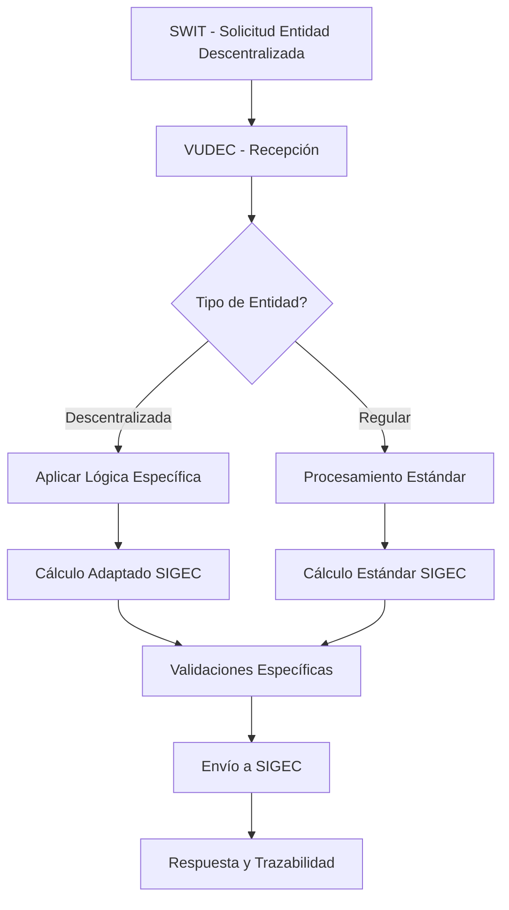

# Proceso VUDEC para Entidades Descentralizadas

## Introducción

Este documento describe el proceso implementado en VUDEC para el manejo de **entidades descentralizadas** que participan en el sistema de recaudo y reporte de estampillas municipales y departamentales. Este proceso forma parte de la **[Epic 001 - Descentralizadas](./scrum/epic%20-%20001/Epic%20001%20-%20Descentralizadas.md)**, diseñada para garantizar el correcto reporte de información a través de la cuenta del cliente en la plataforma VUDEC hacia el sistema SIGEC.

## Contexto del Negocio

Las entidades descentralizadas son organizaciones que tienen características específicas en el manejo de estampillas y requieren un tratamiento diferenciado en el sistema. Estas entidades tienen la función de:

1. **Retener estampillas** municipales o departamentales durante sus procesos operativos
2. **Reportar estas retenciones** a través de declaraciones y exógenas de manera específica
3. **Informar al ente dueño** de la estampilla sobre los valores retenidos y procesados
4. **Gestionar la información** a través de su cuenta en la plataforma VUDEC
5. **Enviar datos correctos** al sistema SIGEC con la lógica de negocio apropiada

## Objetivo del Sistema

El sistema VUDEC debe facilitar la gestión integral de entidades descentralizadas mediante:

- **Registro especializado** de las entidades descentralizadas con sus características específicas
- **Procesamiento diferenciado** según el tipo de entidad y las estampillas que maneja
- **Cálculo adaptado** del request de envío a SIGEC basado en el perfil de la entidad
- **Flujo optimizado** de información entre SWIT y VUDEC para entidades descentralizadas
- **Trazabilidad completa** de los procesos de retención, gestión y reporte
- **Validación específica** de datos según las normativas aplicables

## Flujo de Proceso Integral

### 1. Registro y Configuración de Entidades
- Las entidades descentralizadas deben estar **registradas y configuradas** en VUDEC
- El registro incluye información detallada sobre:
  - Tipo de entidad y naturaleza jurídica
  - Estampillas específicas que maneja
  - Parámetros de cálculo y validación
  - Configuración de reportes

### 2. Recepción y Procesamiento de Solicitudes
- **SWIT envía solicitudes** específicas para entidades descentralizadas
- **VUDEC identifica automáticamente** el tipo de entidad
- Se aplica la **lógica de negocio específica** según el perfil de la entidad
- **Validaciones particulares** se ejecutan según la configuración

### 3. Cálculo y Adaptación para SIGEC
- El **cálculo del request a SIGEC** se modifica automáticamente
- Se aplican **reglas específicas** para entidades descentralizadas
- **Parámetros diferenciados** se incluyen en la transmisión
- **Validaciones de integridad** se ejecutan antes del envío

### 4. Reporte, Seguimiento y Auditoría
- Se genera la **información necesaria** para declaraciones y exógenas
- **Trazabilidad completa** del proceso de principio a fin
- **Auditoría detallada** de cada operación realizada
- **Reportes específicos** para entidades descentralizadas

## Componentes del Sistema

### Epic 001 - Descentralizadas
La implementación de este proceso se desarrolla a través de la **[Epic 001 - Descentralizadas](./scrum/epic%20-%20001/Epic%20001%20-%20Descentralizadas.md)**, que incluye:

#### 📋 Historias de Usuario
- **[HU001](./scrum/hu-001/README.md)** - Entidad (DB) descentralizada
- **[HU002](./scrum/hu-002/README.md)** - Arreglos y adaptaciones paneles de gestión  
- **[HU003](./scrum/hu-003/README.md)** - Arreglos y adaptaciones APIs para información adicional descentralizada

### Módulos Afectados

#### 🗄️ Base de Datos
- Nuevas entidades para entidades descentralizadas
- Relaciones con contratos y movimientos
- Auditoría y trazabilidad específica

#### 🔧 Servicios Backend
- Servicios de gestión de entidades descentralizadas
- Adaptación de lógica de cálculo para SIGEC
- APIs específicas para integración

#### 🖥️ Interfaces Administrativas
- Paneles de gestión adaptados
- Formularios específicos de configuración
- Reportes y consultas especializadas

## Impacto en el Sistema

### Modificaciones Implementadas
- ✅ **Adaptación del módulo de cálculo** para SIGEC con lógica específica
- ✅ **Nuevas APIs** para manejo de entidades descentralizadas
- ✅ **Actualización de procesos** de contratación y gestión
- ✅ **Mejoras en la gestión contractual** con validaciones específicas
- ✅ **Paneles administrativos** adaptados para estas entidades

### Beneficios Alcanzados
- 🎯 **Mayor precisión** en los cálculos de estampillas para entidades específicas
- 🔍 **Mejor control y visibilidad** sobre entidades descentralizadas
- 📊 **Facilidad mejorada** en el proceso de declaraciones y reportes
- ⚖️ **Cumplimiento normativo** optimizado y automatizado
- 🔄 **Integración seamless** con sistemas gubernamentales (SIGEC)

## Flujo Técnico de Integración

## Estado del Proyecto

### 🚀 Epic 001 - En Desarrollo
- **Estado Actual**: En preparación y desarrollo
- **Progreso**: Documentación completa, iniciando desarrollo
- **Próximos Hitos**: Implementación HU001, HU002, HU003

### 📈 Métricas de Progreso
- Documentación: ✅ Completada
- Diseño de Base de Datos: 🔄 En progreso
- APIs Backend: 📋 Pendiente
- Interfaces Frontend: 📋 Pendiente
- Pruebas de Integración: 📋 Pendiente

## Documentación Relacionada

- 📋 **[Epic 001 - Descentralizadas](./scrum/epic%20-%20001/Epic%20001%20-%20Descentralizadas.md)** - Documentación completa de la épica
- 📖 **[Manual de Implementación](./IMPLEMENTATION_MANUAL.md)** - Guía técnica general
- 🗂️ **[Estructura del Proyecto Scrum](./scrum/README.md)** - Organización del desarrollo

## Contacto y Soporte

Para consultas relacionadas con el proceso de entidades descentralizadas:

- **Equipo de Desarrollo**: [Por definir]
- **Product Owner**: [Por definir]
- **Expertos de Dominio**: [Por definir]

---

**Fecha de creación:** Octubre 2025  
**Última actualización:** Octubre 2025  
**Versión:** 2.0  
**Estado:** 🔄 En desarrollo activo - Epic 001

## Próximas Actualizaciones

Este documento se actualizará conforme avance el desarrollo de la Epic 001, incluyendo:
- Detalles técnicos de implementación
- Resultados de pruebas y validaciones
- Guías de usuario final
- Métricas de rendimiento y adopción