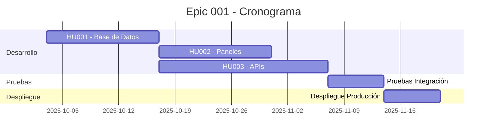

# Epic 001 - Descentralizadas

## Introducción

La **Epic 001 - Descentralizadas** forma parte del proceso integral de gestión de entidades descentralizadas en la plataforma VUDEC. Esta épica se enfoca en permitir que las entidades descentralizadas puedan reportar correctamente su información a través de la cuenta del cliente en VUDEC, asegurando que los datos sean procesados y enviados de manera precisa al sistema SIGEC.

## Contexto del Negocio

Las entidades descentralizadas son organizaciones que tienen características particulares en el manejo de estampillas municipales y departamentales. Estas entidades requieren un tratamiento diferenciado en el sistema VUDEC para:

- **Gestión específica de retenciones**: Manejo particular de las estampillas que retienen
- **Reporte diferenciado**: Envío de información con lógica de negocio específica
- **Integración con SIGEC**: Transmisión correcta de datos al sistema gubernamental
- **Trazabilidad completa**: Seguimiento detallado de todos los procesos

## Objetivos de la Epic

### Objetivo Principal
Implementar un sistema robusto que permita la gestión integral de entidades descentralizadas en VUDEC, garantizando el correcto reporte de información al SIGEC.

### Objetivos Específicos
1. **Registro y Gestión**: Crear mecanismos para registrar y administrar entidades descentralizadas
2. **Procesamiento Diferenciado**: Implementar lógica de negocio específica para estas entidades
3. **Integración SIGEC**: Asegurar el correcto envío de información al sistema gubernamental
4. **Validación y Control**: Establecer controles de calidad y validaciones específicas
5. **Auditoría y Trazabilidad**: Mantener registro completo de todas las operaciones

## Alcance de la Epic

### ✅ Incluido en la Epic
- Desarrollo de entidades de base de datos para entidades descentralizadas
- Implementación de servicios y APIs específicos
- Adaptación de paneles de gestión administrativos
- Modificación de lógica de cálculo para SIGEC
- Validaciones y controles de calidad específicos
- Documentación técnica y funcional

### ❌ Excluido de la Epic
- Modificaciones en sistemas externos a VUDEC
- Cambios en la normatividad gubernamental
- Integraciones con sistemas de terceros no especificados
- Modificaciones en la arquitectura base del sistema

## Historias de Usuario Asociadas

La Epic 001 se compone de las siguientes historias de usuario:

### 🔹 [HU001 - Entidad (DB) descentralizada](./HU001%20-%20Entidad%20(DB)%20descentralizada.md)
**Descripción**: Extensión de la entidad Taxpayer para soportar entidades descentralizadas
**Enfoque**: Extensión de entidad existente (Taxpayer) vs. nueva entidad
**Estado**: 📋 Documentado - Listo para desarrollo
**Prioridad**: Alta

### 🔹 [HU002 - Arreglos y adaptaciones paneles de gestión](../hu-002/README.md)
**Descripción**: Adaptación de interfaces administrativas para gestión de entidades descentralizadas
**Estado**: 📋 Pendiente
**Prioridad**: Media

### 🔹 [HU003 - Arreglos y adaptaciones APIs para información adicional descentralizada](../hu-003/README.md)
**Descripción**: Desarrollo y adaptación de APIs para manejo de información específica
**Estado**: 📋 Pendiente
**Prioridad**: Alta

## Decisión Arquitectónica Clave

### 🏗️ Enfoque de Base de Datos: Extensión de Taxpayer

**Decisión**: Se ha decidido **extender la entidad `Taxpayer` existente** en lugar de crear una nueva entidad separada para entidades descentralizadas.

#### ✅ Justificación
- **Reutilización máxima**: Aprovecha toda la infraestructura existente (servicios, validaciones, relaciones)
- **Consistencia arquitectónica**: Mantiene un patrón unificado para entidades de terceros
- **Menor complejidad**: Evita duplicación de código y lógica
- **Integración natural**: Las relaciones con contratos y organizaciones funcionan automáticamente
- **Evolución incremental**: Permite agregar funcionalidad sin disrumpir el sistema

#### 🔧 Campos Agregados a Taxpayer
- `isDecentralized`: Identificador booleano
- `entityType`: Tipo específico de entidad
- `verificationDigit`: Dígito de verificación
- `department`: Departamento de ubicación
- `municipality`: Municipio de ubicación
- `notificationAddress`: Dirección para notificaciones
- `isRetainerEntity`: Si es entidad retenedora
- `sigecCode`: Código asignado por SIGEC

Esta decisión permite mantener la simplicidad del sistema mientras se agregan las capacidades requeridas para entidades descentralizadas.

## Criterios de Aceptación de la Epic

Para considerar la Epic 001 como completada, se debe cumplir:

- [x] **Registro Funcional**: Las entidades descentralizadas se pueden registrar, consultar, modificar y eliminar
- [x] **Procesamiento Correcto**: El sistema procesa correctamente las solicitudes de entidades descentralizadas
- [x] **Integración SIGEC**: La información se envía correctamente al SIGEC con la lógica específica
- [x] **Interfaces Operativas**: Los paneles administrativos permiten gestión completa
- [x] **APIs Funcionales**: Las APIs responden correctamente a las solicitudes
- [x] **Validaciones Activas**: Todos los controles de calidad funcionan correctamente
- [x] **Documentación Completa**: Toda la documentación técnica y funcional está actualizada

## Dependencias

### Dependencias Internas
- Módulo de contratos existente en VUDEC
- Sistema de auditoría y logging
- APIs de integración con SIGEC

### Dependencias Externas
- Especificaciones actualizadas del SIGEC
- Validación de requerimientos de negocio
- Aprobación de flujos de proceso

## Riesgos Identificados

| Riesgo | Probabilidad | Impacto | Mitigación |
|--------|--------------|---------|------------|
| Cambios en especificaciones SIGEC | Media | Alto | Monitoreo constante de cambios gubernamentales |
| Complejidad de integración | Alta | Alto | Desarrollo incremental con validaciones frecuentes |
| Disponibilidad de información de negocio | Media | Medio | Sesiones regulares con expertos de dominio |

## Cronograma Estimado

## Definición de Terminado (DoD)

- [ ] Código desarrollado y revisado por pares
- [ ] Pruebas unitarias implementadas (cobertura ≥ 80%)
- [ ] Pruebas de integración exitosas
- [ ] Documentación técnica actualizada
- [ ] Validación con usuarios finales
- [ ] Deployment en ambiente de staging exitoso
- [ ] Aprobación del Product Owner
- [ ] Sin defectos críticos o de alta prioridad

## Contactos y Responsables

- **Product Owner**: [Por definir]
- **Scrum Master**: [Por definir]
- **Tech Lead**: [Por definir]
- **Equipo de Desarrollo**: [Por definir]

---

**Fecha de Creación**: Octubre 2025  
**Última Actualización**: Octubre 2025  
**Versión**: 1.0  
**Estado**: 🚀 En preparación

## Enlaces Relacionados

- [📋 Documento Principal - Entidades Descentralizadas](../../ENTIDADES_DESCENTRALIZADAS.md)
- [📖 Manual de Implementación](../../IMPLEMENTATION_MANUAL.md)
- [🗂️ Estructura del Proyecto Scrum](../README.md)
