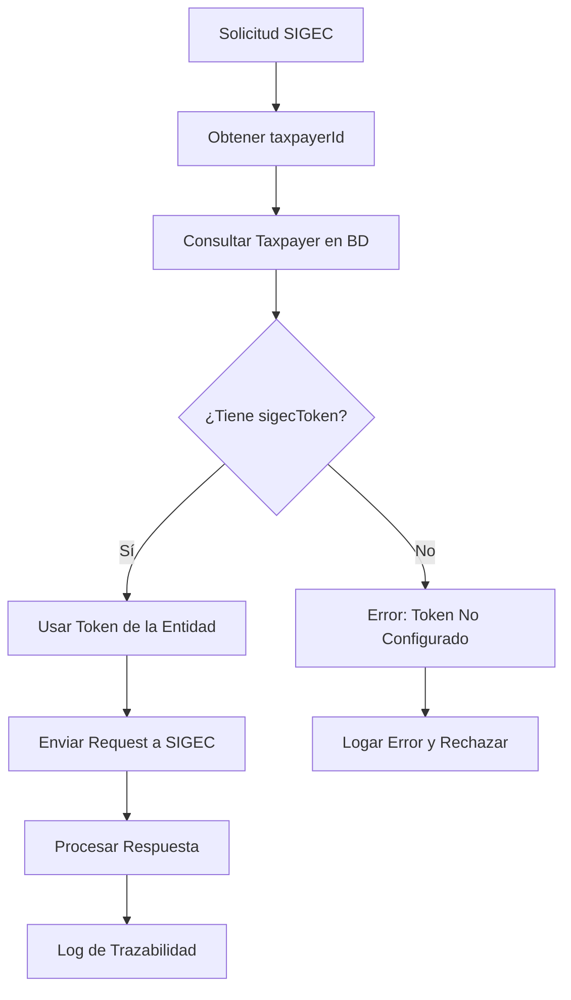

# HU003 - Arreglos y adaptaciones APIs para información adicional descentralizada

## Descripción de la Historia de Usuario

**Como** sistema integrador (VUDEC)  
**Quiero** consumir y proporcionar APIs adaptadas que manejen correctamente la información específica de entidades descentralizadas  
**Para que** el sistema pueda procesar y reportar al SIGEC utilizando el token específico de cada entidad almacenado en la base de datos

## Contexto y Justificación

La integración con SIGEC requiere tokens de autenticación específicos para cada entidad que realiza el reporte:

- **Entidades Territoriales**: Utilizan su token específico almacenado en la base de datos
- **Entidades Descentralizadas**: Cada una tiene su propio token único generado por SIGEC y almacenado en su registro

Según la documentación gubernamental, el sistema debe validar que el token enviado corresponda exactamente con el que se generó para el registro de la entidad específica que realiza la solicitud. **Cada entidad tiene su propio token único** que debe ser persistido y utilizado en las comunicaciones con SIGEC.

## Problema Actual

### 🔴 Estado Actual del SigecManager
```typescript
@Injectable()
export class SigecManager {
  private readonly baseUrl: string;
  private readonly token: string; // ❌ Token fijo único de variables de entorno

  constructor(private readonly httpService: HttpService) {
    this.baseUrl = process.env.SIGEC_URL || 'https://preprosigec.colombiacompra.gov.co/gateway/stamp/v1/stamp/';
    this.token = process.env.SIGEC_TOKEN || 'b5567605641458621738229047107f7e2df466f74695283a5c569ca7e5d5b9fb';
  }

  private getHeaders(): Record<string, string> {
    return {
      Authorization: this.token, // ❌ Siempre el mismo token para todas las entidades
      'Content-Type': 'application/json',
    };
  }
}
```

### ⚠️ Limitaciones Identificadas
1. **Token único global**: No diferencia entre entidades individuales
2. **Configuración estática**: Basado en variables de entorno
3. **Falta de personalización**: Cada entidad requiere su propio token
4. **Validación SIGEC**: El token debe corresponder exactamente a la entidad específica
5. **Escalabilidad limitada**: No permite tokens únicos por entidad

## Solución Propuesta

### 🔹 Modificación del SigecManager

#### Arquitectura Basada en Tokens de Base de Datos
```typescript
@Injectable()
export class SigecManager {
  private readonly baseUrl: string;

  constructor(
    private readonly httpService: HttpService,
    private readonly taxpayerService: TaxpayerService // 🆕 Inyección del servicio de taxpayer
  ) {
    this.baseUrl = process.env.SIGEC_URL || 'https://preprosigec.colombiacompra.gov.co/gateway/stamp/v1/stamp/';
  }

  private async getHeaders(taxpayerId: string): Promise<Record<string, string>> {
    // 🆕 Consultar token específico de la entidad desde la base de datos
    const taxpayer = await this.taxpayerService.findById(taxpayerId);
    
    if (!taxpayer.sigecToken) {
      throw new BadRequestException(`Entity ${taxpayer.name} does not have a SIGEC token configured`);
    }

    return {
      Authorization: taxpayer.sigecToken,
      'Content-Type': 'application/json',
    };
  }
}
```

#### Métodos Actualizados con Token Específico por Entidad
```typescript
async reportContract(data: ReportContractRequest, taxpayerId: string): Promise<ReportContractResponse> {
  const url = `${this.baseUrl}${SigecMethod.reportContract}`;
  try {
    const headers = await this.getHeaders(taxpayerId); // 🆕 Token específico de la entidad
    const response = await firstValueFrom(
      this.httpService.post(url, data, { headers })
    );
    return response.data as ReportContractResponse;
  } catch (error) {
    console.log(`Error reporting contract for taxpayer ${taxpayerId}: ${error.message}`);
    return { message: error?.response?.data?.message } as ReportContractResponse;
  }
}

async registerLiquidation(data: RegisterLiquidationRequest, taxpayerId: string): Promise<RegisterLiquidationResponse> {
  const url = `${this.baseUrl}${SigecMethod.registerLiquidation}`;
  try {
    const headers = await this.getHeaders(taxpayerId); // 🆕 Token específico de la entidad
    const response = await firstValueFrom(
      this.httpService.post(url, data, { headers })
    );
    return response.data as RegisterLiquidationResponse;
  } catch (error) {
    console.log(`Error registering liquidation for taxpayer ${taxpayerId}: ${error.message}`);
    return { message: error?.response?.data?.message } as RegisterLiquidationResponse;
  }
}

async registerPayment(data: RegisterPaymentRequest, taxpayerId: string): Promise<RegisterPaymentResponse> {
  const url = `${this.baseUrl}${SigecMethod.registerPayment}`;
  try {
    const headers = await this.getHeaders(taxpayerId); // 🆕 Token específico de la entidad
    const response = await firstValueFrom(
      this.httpService.post(url, data, { headers })
    );
    return response.data as RegisterPaymentResponse;
  } catch (error) {
    console.log(`Error registering payment for taxpayer ${taxpayerId}: ${error.message}`);
    return { message: error?.response?.data?.message } as RegisterPaymentResponse;
  }
}
```

### 🔹 Actualización del SigecService

```typescript
@Injectable()
export class SigecService {
  constructor(
    private readonly sigecManager: SigecManager,
    private readonly eventEmitter: EventEmitter2,
  ) {}

  @OnEvent(SigecEvents.ReportContract)
  async handleReportContract(data: ReportContractRequest & { taxpayerId: string }): Promise<ReportContractResponse> {
    try {
      if (!data.taxpayerId) {
        throw new BadRequestException('taxpayerId is required for SIGEC operations');
      }
      return await this.sigecManager.reportContract(data, data.taxpayerId);
    } catch (error) {
      console.log(`Error in handleReportContract for taxpayer ${data.taxpayerId}: ${error.message}`);
      throw error;
    }
  }

  @OnEvent(SigecEvents.RegisterLiquidation)
  async handleRegisterLiquidation(data: RegisterLiquidationRequest & { taxpayerId: string }): Promise<RegisterLiquidationResponse> {
    try {
      if (!data.taxpayerId) {
        throw new BadRequestException('taxpayerId is required for SIGEC operations');
      }
      return await this.sigecManager.registerLiquidation(data, data.taxpayerId);
    } catch (error) {
      console.log(`Error in handleRegisterLiquidation for taxpayer ${data.taxpayerId}: ${error.message}`);
      throw error;
    }
  }

  @OnEvent(SigecEvents.RegisterPayment)
  async handleRegisterPayment(data: RegisterPaymentRequest & { taxpayerId: string }): Promise<RegisterPaymentResponse> {
    try {
      if (!data.taxpayerId) {
        throw new BadRequestException('taxpayerId is required for SIGEC operations');
      }
      return await this.sigecManager.registerPayment(data, data.taxpayerId);
    } catch (error) {
      console.log(`Error in handleRegisterPayment for taxpayer ${data.taxpayerId}: ${error.message}`);
      throw error;
    }
  }
}
```

## Cambios Específicos Requeridos

### 🔹 1. Campo SIGEC Token en Taxpayer (Relación con HU001)
Agregar campo para almacenar el token específico de cada entidad:

```typescript
// En taxpayer.entity.ts (extensión de HU001)
@Column({ nullable: true })
@Field(() => String, { nullable: true })
sigecToken?: string; // 🆕 Token específico de SIGEC para esta entidad
```

### 🔹 2. Extensión de DTOs
Modificar los DTOs para incluir el ID de la entidad taxpayer:

```typescript
// Extender interfaces existentes
export interface SigecRequestWithTaxpayer extends ReportContractRequest {
  taxpayerId: string; // 🆕 ID de la entidad que realiza el reporte
}

export interface SigecLiquidationWithTaxpayer extends RegisterLiquidationRequest {
  taxpayerId: string; // 🆕 ID de la entidad
}

export interface SigecPaymentWithTaxpayer extends RegisterPaymentRequest {
  taxpayerId: string; // 🆕 ID de la entidad
}
```

### 🔹 3. Gestión de Tokens en UI (Relación con HU002)
En la sección de configuración de entidades descentralizadas:

```typescript
// Formulario de entidad descentralizada
interface DecentralizedEntityForm {
  // ... otros campos de HU001
  sigecToken: string; // 🆕 Campo para ingresar/editar token SIGEC
  tokenStatus: 'pending' | 'active' | 'expired'; // 🆕 Estado del token
  tokenAssignedDate: Date; // 🆕 Fecha de asignación del token
}
```

### 🔹 4. Integración con MovementService
Actualizar el `MovementService` para pasar el ID de la entidad taxpayer:

```typescript
// En movement.service.ts
private async handleSendAdhesionMovement(context: IContext, movement: Movement, contract: Contract, taxpayer: Taxpayer, stamp: Stamp): Promise<void> {
  const adhesionRequest = {
    actDocumentCode: contract.consecutive,
    factCodeGenerator: movement.expenditureNumber,
    liquidatedValueId: movement.movId,
    liquidatedValue: movement.liquidatedValue,
    payerDocumentParametricTypeCode: this.mapDocumentTypeToSigecCode(taxpayer.taxpayerNumberType),
    stampNumber: stamp.stampNumber,
    taxpayerDocumentNumber: taxpayer.taxpayerNumber.toString(),
    type: movement.isRevert ? 0 : 1,
    taxpayerId: taxpayer.id, // 🆕 ID de la entidad para consultar su token específico
  } as RegisterLiquidationRequest & { taxpayerId: string };

  const [result] = (await this.eventEmitter.emitAsync(SigecEvents.RegisterLiquidation, adhesionRequest)) as RegisterLiquidationResponse[];
}

private async handleSendApplyMovement(context: IContext, movement: Movement): Promise<void> {
  // Consultar el taxpayer asociado al movimento para obtener su ID
  const contract = await movement.contract;
  const taxpayer = await contract.taxpayer;
  
  const applyRequest = {
    liquidatedValueId: movement.movId.replace('APPLY', 'ADHESION'),
    paidValueId: movement.movId,
    paymentDate: this.formatDateOnlyDate(new Date(movement.date)),
    type: movement.isRevert ? '0' : '1',
    valuePaid: movement.paidValue,
    taxpayerId: taxpayer.id, // 🆕 ID de la entidad
  } as RegisterPaymentRequest & { taxpayerId: string };

  const [result] = (await this.eventEmitter.emitAsync(SigecEvents.RegisterPayment, applyRequest)) as RegisterPaymentResponse[];
}
```

## Criterios de Aceptación

### ✅ Criterio 1: Token Específico por Entidad
- **Dado** que soy una entidad registrada en VUDEC
- **Cuando** tengo un token SIGEC asignado en mi registro
- **Entonces** todas mis comunicaciones con SIGEC utilizan únicamente mi token específico
- **Y** el sistema valida que el token esté presente antes de realizar solicitudes
- **Y** se logea el uso del token (sin exponer el valor completo) para auditoría

### ✅ Criterio 2: Gestión de Tokens en Base de Datos
- **Dado** que administro entidades descentralizadas
- **Cuando** registro o edito una entidad
- **Entonces** puedo asignar, modificar o eliminar su token SIGEC específico
- **Y** el sistema valida el formato del token
- **Y** se mantiene un historial de cambios de tokens

### ✅ Criterio 3: Integración con Movimientos
- **Dado** que se procesa un movimiento de estampillas
- **Cuando** se envía información a SIGEC
- **Entonces** se utiliza automáticamente el token de la entidad asociada al contrato
- **Y** se verifica que la entidad tenga un token válido configurado
- **Y** se registra la trazabilidad del token utilizado

### ✅ Criterio 4: Manejo de Errores de Token
- **Dado** que una entidad no tiene token SIGEC configurado
- **Cuando** se intenta realizar una operación SIGEC
- **Entonces** el sistema muestra un error claro indicando la falta de token
- **Y** se logea el intento fallido para seguimiento
- **Y** no se realiza la comunicación con SIGEC

### ✅ Criterio 5: Retrocompatibilidad
- **Dado** que tengo entidades territoriales existentes
- **Cuando** migro al nuevo sistema
- **Entonces** se puede configurar un token por defecto para entidades sin token específico
- **Y** las entidades existentes continúan funcionando
- **Y** se puede migrar gradualmente a tokens específicos por entidad

## Tareas Técnicas Detalladas

### 🔹 Tarea 1: Actualización de SigecManager
- [ ] Remover configuración de tokens desde variables de entorno
- [ ] Inyectar TaxpayerService para consultas de base de datos
- [ ] Modificar método `getHeaders()` para consultar token por taxpayerId
- [ ] Actualizar métodos `reportContract`, `registerLiquidation`, `registerPayment` para recibir taxpayerId
- [ ] Agregar validación de existencia de token
- [ ] Implementar logging específico por entidad

### 🔹 Tarea 2: Extensión de SigecService
- [ ] Actualizar handlers de eventos para recibir taxpayerId
- [ ] Modificar llamadas al SigecManager pasando el ID correcto
- [ ] Agregar validaciones de entrada para taxpayerId
- [ ] Implementar manejo de errores específico por entidad
- [ ] Mantener compatibilidad con eventos existentes

### 🔹 Tarea 3: Actualización de DTOs e Interfaces
- [ ] Crear interfaces extendidas con campo `taxpayerId`
- [ ] Actualizar eventos para incluir ID de entidad
- [ ] Mantener compatibilidad con interfaces existentes
- [ ] Documentar nuevas interfaces y cambios

### 🔹 Tarea 4: Integración con MovementService
- [ ] Identificar puntos donde se realizan llamadas SIGEC
- [ ] Modificar construcción de requests para incluir taxpayerId
- [ ] Actualizar llamadas a eventos SIGEC con ID de entidad
- [ ] Consultar taxpayer asociado a contratos/movimientos
- [ ] Agregar validaciones de token antes de envío

### 🔹 Tarea 5: Extensión de Taxpayer Entity (Coordinar con HU001)
- [ ] Agregar campo `sigecToken` a la entidad Taxpayer
- [ ] Actualizar DTOs de Taxpayer para incluir gestión de tokens
- [ ] Crear validaciones para formato de token SIGEC
- [ ] Implementar auditoría de cambios de tokens
- [ ] Agregar índices si es necesario para optimizar consultas

### 🔹 Tarea 6: Gestión de Tokens en UI (Coordinar con HU002)
- [ ] Agregar campo de token SIGEC en formularios de entidades
- [ ] Implementar validaciones del frontend para tokens
- [ ] Crear indicadores visuales de estado de token
- [ ] Agregar funcionalidad de prueba de token
- [ ] Implementar gestión de historial de tokens

### 🔹 Tarea 7: Migración y Compatibilidad
- [ ] Crear migración de base de datos para campo sigecToken
- [ ] Implementar estrategia de migración para entidades existentes
- [ ] Agregar token por defecto configurable para retrocompatibilidad
- [ ] Crear scripts de validación de tokens
- [ ] Documentar proceso de migración

## Estructura de Base de Datos

### Campo SIGEC Token en Taxpayer
```sql
-- Migración para agregar campo de token SIGEC
ALTER TABLE vudec_taxpayer 
ADD COLUMN sigec_token VARCHAR(255) NULL;

-- Índice para optimizar consultas por token (opcional)
CREATE INDEX idx_taxpayer_sigec_token ON vudec_taxpayer(sigec_token) 
WHERE sigec_token IS NOT NULL;
```

### Gestión de Tokens por Entidad
```typescript
// Ejemplo de configuración de tokens en la base de datos
{
  "taxpayerId": "uuid-entidad-territorial",
  "name": "Alcaldía Municipal de Guadalajara de Buga",
  "isDecentralized": false,
  "sigecToken": "b5567605641458621738229047107f7e2df466f74695283a5c569ca7e5d5b9fb"
}

{
  "taxpayerId": "uuid-entidad-descentralizada",
  "name": "Instituto Educativo Descentralizado",
  "isDecentralized": true,
  "sigecToken": "a8834712543876293847103948571048294857193874059283740192837402"
}
```

## Flujo de Decisión de Token



## Impacto en el Sistema

### ✅ Beneficios Esperados
- **Token específico por entidad**: Cada entidad usa su propio token único de SIGEC
- **Flexibilidad total**: Capacidad de manejar tokens únicos para cada entidad registrada
- **Trazabilidad granular**: Seguimiento específico del token utilizado por cada entidad
- **Gestión centralizada**: Administración de tokens desde la UI de VUDEC
- **Cumplimiento estricto**: Alineación perfecta con requerimientos SIGEC de tokens únicos
- **Escalabilidad**: Soporte para cualquier cantidad de entidades con tokens únicos

### ⚠️ Riesgos y Consideraciones
- **Migración de datos**: Necesidad de asignar tokens a entidades existentes
- **Gestión de tokens**: Cada entidad debe tener su token configurado correctamente
- **Seguridad de tokens**: Manejo apropiado de múltiples tokens sensibles en base de datos
- **Validación de tokens**: Verificar que todos los tokens sean válidos antes de usar
- **Backup y recuperación**: Asegurar que los tokens se respalden apropiadamente

## Definición de Terminado (DoD)

- [ ] SigecManager modificado para soportar múltiples tokens
- [ ] SigecService actualizado con nuevos handlers
- [ ] DTOs e interfaces extendidas documentadas
- [ ] MovementService integrado con nueva lógica
- [ ] EntityTypeResolver implementado y funcional
- [ ] Variables de entorno configuradas apropiadamente
- [ ] Pruebas unitarias implementadas para ambos tipos de token
- [ ] Pruebas de integración exitosas con SIGEC (ambos endpoints)
- [ ] Documentación técnica actualizada
- [ ] Validación en ambiente de staging
- [ ] Code review aprobado
- [ ] No regresiones en funcionalidad existente

## Estimación y Prioridad

- **Story Points**: 13
- **Prioridad**: Alta
- **Sprint Sugerido**: Sprint 1-2
- **Duración Estimada**: 2-3 semanas
- **Dependencias**: HU001 (estructura de Taxpayer extendida)

## Enlaces y Referencias

- [📋 Epic 001 - Descentralizadas](./Epic%20001%20-%20Descentralizadas.md)
- [🗄️ HU001 - Entidad (DB) descentralizada](./HU001%20-%20Entidad%20(DB)%20descentralizada.md)
- [🎨 HU002 - Paneles de gestión](./HU002%20-%20Arreglos%20y%20adaptaciones%20paneles%20de%20gestion.md)
- [📋 Documento Principal](../../ENTIDADES_DESCENTRALIZADAS.md)
- [🔧 Servicio SIGEC Actual](../../../external-api/sigec/services/sigec.manager.service.ts)

---

**Fecha de Creación**: Octubre 2025  
**Última Actualización**: Octubre 2025  
**Responsable**: Equipo Backend  
**Estado**: 📋 Documentado - Listo para desarrollo

## Notas Adicionales

- Esta HU es crítica para el correcto funcionamiento de la integración con SIGEC
- La implementación debe mantener total retrocompatibilidad
- Se debe prestar especial atención a la seguridad en el manejo de tokens
- La documentación de SIGEC oficial debe ser consultada para validar requerimientos específicos
