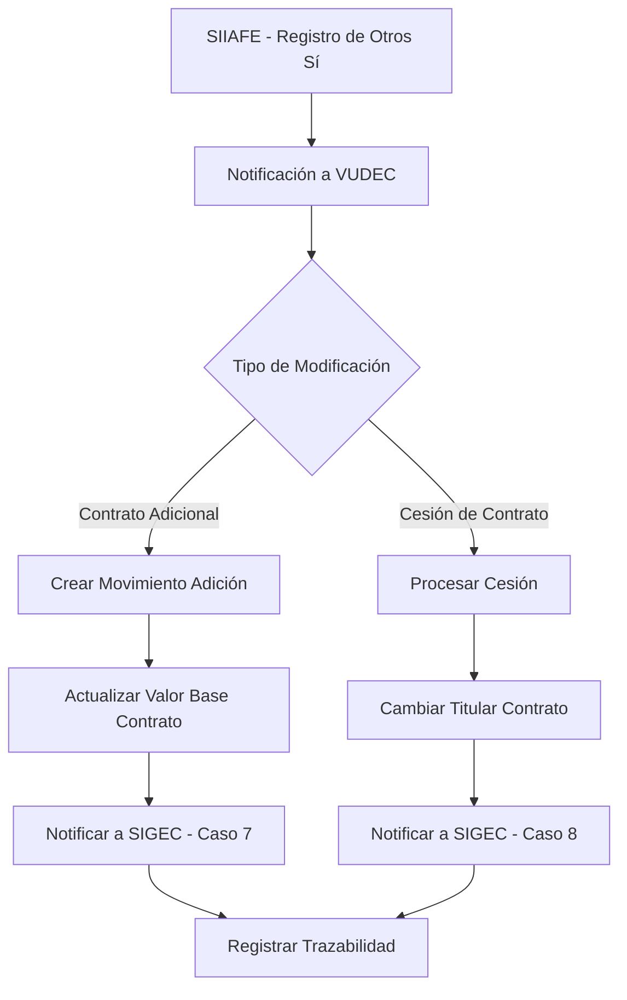
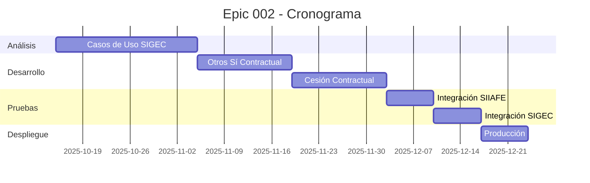

# Epic 002 - Adecuaciones CU SIIAFE

## Introducción

La **Epic 002 - Adecuaciones CU SIIAFE** se enfoca en implementar las adaptaciones necesarias en los casos de uso de SIIAFE para el manejo de **"otros sí"** de contratos. Estos "otros sí" permiten realizar adiciones de valor a contratos existentes, generando movimientos específicos de tipo "adición" que deben ser correctamente procesados tanto en el sistema financiero como en VUDEC.

## Contexto del Negocio

### Problemática Actual
Los contratos pueden requerir modificaciones durante su vigencia a través de **"otros sí"** que permiten:
- **Adición de valor** al contrato original
- **Extensión de plazo** de ejecución  
- **Modificación de condiciones** contractuales específicas

Actualmente, el sistema no maneja adecuadamente estos casos de uso, específicamente para **contratos adicionales (OTROSI)** que requieren:
1. **Notificación desde SIIAFE** cuando se registra un "otros sí"
2. **Procesamiento en VUDEC** para generar movimientos de adición
3. **Actualización del valor** contractual base
4. **Trazabilidad** de las modificaciones contractuales

### Casos de Uso Identificados (Según SIIAFE)

#### 🔹 Caso de Uso 7 - SIGEC
**Contrato Adicional (OTROSI)**: Cuando el tipo de contrato (`CTRATIPCTRA`) es un **CONTRATO ADICIONAL (OTROSI) (30)**, se requiere enviar a VUDEC el registro de la modificación por adición del contrato.

#### 🔹 Caso de Uso 8 - SIGEC  
**Cesión de Contrato**: Cuando el tipo de contrato es **CESIÓN DE CONTRATO (33)** y el código de hecho generador ya está registrado a nombre de un tercero diferente, se debe enviar a SIGEC el registro de cesión de contrato.

## Objetivos de la Epic

### Objetivo Principal
Implementar las adecuaciones necesarias en VUDEC y la integración con SIIAFE para manejar correctamente los "otros sí" contractuales, permitiendo el registro de movimientos de adición y la actualización de valores contractuales.

### Objetivos Específicos
1. **Recepción de Notificaciones**: Implementar endpoint para recibir notificaciones de "otros sí" desde SIIAFE
2. **Procesamiento de Adiciones**: Crear lógica para procesar movimientos de tipo "adición" al contrato base
3. **Actualización de Valores**: Modificar el valor contractual base con las adiciones correspondientes
4. **Validaciones Específicas**: Implementar validaciones para "otros sí" según normativa
5. **Integración SIGEC**: Adaptar comunicación con SIGEC para casos de adición y cesión
6. **Trazabilidad Completa**: Mantener historial de todas las modificaciones contractuales

## Alcance de la Epic

### ✅ Incluido en la Epic
- Adaptación de endpoints para recibir notificaciones de "otros sí" desde SIIAFE
- Implementación de tipos de movimiento para adiciones contractuales
- Lógica de actualización de valores contractuales
- Validaciones específicas para contratos adicionales (OTROSI)
- Integración con SIGEC para casos de uso 7 y 8
- Interfaz administrativa para gestión de "otros sí"
- Documentación de procesos y casos de uso

### ❌ Excluido de la Epic
- Modificaciones en SIIAFE (sistema externo)
- Cambios en normatividad contractual
- Otros tipos de modificaciones contractuales no relacionadas con adiciones
- Integraciones con sistemas diferentes a SIGEC

## Arquitectura de la Solución

### 🔹 Flujo de Proceso Principal



### 🔹 Puntos de Integración

#### 1. **SIIAFE → VUDEC**
- **Endpoint**: `/api/vudec/contract-modifications`
- **Método**: POST
- **Trigger**: Registro de "otros sí" en SIIAFE
- **Payload**: Información del contrato modificado y tipo de adición

#### 2. **VUDEC → SIGEC**
- **Caso 7**: Reporte de contrato adicional (adición de valor)
- **Caso 8**: Reporte de cesión de contrato
- **Protocolo**: Uso de tokens específicos según entidad (Epic 001)

## Casos de Uso Detallados

### 🔹 Caso de Uso 7: Contrato Adicional (OTROSI)

#### Descripción
Cuando SIIAFE registra un contrato con tipo **CONTRATO ADICIONAL (OTROSI) (30)**, debe notificar a VUDEC para:
1. Crear un movimiento de tipo "ADICIÓN"
2. Actualizar el valor base del contrato original
3. Notificar el cambio a SIGEC

#### Flujo Técnico
```typescript
interface ContractAdditionNotification {
  originalContractCode: string;      // No. Contrato original
  additionContractCode: string;      // No. Contrato de adición (otros sí)
  additionValue: number;             // Valor de la adición
  additionDate: Date;                // Fecha de la adición
  taxpayerId: string;                // ID de la entidad
  observations?: string;             // Observaciones
}
```

#### Validaciones
- Verificar que el contrato original existe
- Validar que el valor de adición es positivo
- Confirmar que la entidad está autorizada para modificaciones
- Verificar que no existan adiciones duplicadas

### 🔹 Caso de Uso 8: Cesión de Contrato

#### Descripción
Cuando se registra una **CESIÓN DE CONTRATO (33)** donde el código de hecho generador ya está registrado a nombre de un tercero diferente:
1. Cambiar el titular del contrato
2. Actualizar información del nuevo responsable
3. Notificar el cambio a SIGEC

#### Flujo Técnico
```typescript
interface ContractCessionNotification {
  contractCode: string;              // No. Contrato a ceder
  originalTaxpayerId: string;        // ID del titular original
  newTaxpayerId: string;             // ID del nuevo titular
  cessionDate: Date;                 // Fecha de cesión
  legalDocument?: string;            // Documento legal de cesión
  observations?: string;             // Observaciones
}
```

## Tipos de Movimiento Nuevos

### 🆕 MovementType.ADDITION
```typescript
enum TypeMovement {
  // Tipos existentes...
  Register = 'REGISTER',
  Adhesion = 'ADHESION', 
  Apply = 'APPLY',
  // Nuevos tipos
  ADDITION = 'ADDITION',     // 🆕 Movimiento de adición por otros sí
  CESSION = 'CESSION',       // 🆕 Movimiento de cesión de contrato
}
```

### Características del Movimiento ADDITION
- **Valor**: Monto de la adición al contrato
- **Referencia**: Código del contrato de "otros sí"
- **Contrato base**: Referencia al contrato original
- **Tipo de adición**: Especifica el tipo de modificación
- **Estado**: Pendiente, Procesado, Enviado a SIGEC

## Historias de Usuario de la Epic

### 🔹 [HU004 - Proceso de determinación de casos de usos SIGEC](./HU004%20-%20Proceso%20determinacion%20casos%20uso%20SIGEC.md)
**Descripción**: Implementar lógica para determinar y procesar casos de uso 7 y 8 de SIGEC
**Estado**: 📋 Pendiente
**Prioridad**: Alta

### 🔹 [HU005 - Proceso de otros sí contractual](./HU005%20-%20Proceso%20otros%20si%20contractual.md)
**Descripción**: Implementar proceso completo para manejo de "otros sí" contractuales
**Estado**: 📋 Pendiente  
**Prioridad**: Alta

### 🔹 [HU006 - Proceso de cesión contractual](./HU006%20-%20Proceso%20cesion%20contractual.md)
**Descripción**: Implementar proceso de cesión de contratos entre entidades
**Estado**: 📋 Pendiente
**Prioridad**: Media

## Criterios de Aceptación de la Epic

Para considerar la Epic 002 como completada, se debe cumplir:

- [x] **Recepción de Notificaciones**: VUDEC puede recibir y procesar notificaciones de "otros sí" desde SIIAFE
- [x] **Movimientos de Adición**: Se crean correctamente movimientos de tipo ADDITION
- [x] **Actualización de Valores**: Los valores base de contratos se actualizan con las adiciones
- [x] **Integración SIGEC**: Los casos de uso 7 y 8 se reportan correctamente a SIGEC
- [x] **Validaciones Activas**: Todas las validaciones de negocio funcionan correctamente
- [x] **Trazabilidad Completa**: Se mantiene historial completo de modificaciones
- [x] **Interfaz Administrativa**: Los usuarios pueden gestionar "otros sí" desde la UI

## Dependencias

### Dependencias Internas
- Epic 001 (Entidades Descentralizadas) - Para manejo de tokens específicos
- Módulo de contratos existente en VUDEC
- Sistema de movimientos y liquidaciones
- Integración actual con SIGEC

### Dependencias Externas
- Especificaciones de SIIAFE para notificaciones
- Casos de uso 7 y 8 de SIGEC debidamente documentados
- Acceso a sistemas de prueba de SIIAFE
- Validación con equipos de SIIAFE

## Riesgos Identificados

| Riesgo | Probabilidad | Impacto | Mitigación |
|--------|--------------|---------|------------|
| Cambios en especificaciones SIIAFE | Media | Alto | Coordinación continua con equipo SIIAFE |
| Complejidad en lógica de adiciones | Alta | Medio | Desarrollo incremental con validaciones |
| Integración con SIGEC casos 7 y 8 | Media | Alto | Pruebas exhaustivas en ambientes controlados |
| Validación de reglas de negocio | Media | Medio | Sesiones con expertos contractuales |

## Cronograma Estimado



## Definición de Terminado (DoD)

- [ ] Endpoints de integración con SIIAFE implementados y funcionales
- [ ] Tipos de movimiento ADDITION y CESSION operativos
- [ ] Lógica de actualización de valores contractuales funcionando
- [ ] Casos de uso 7 y 8 de SIGEC implementados correctamente
- [ ] Validaciones de negocio implementadas y probadas
- [ ] Interfaz administrativa para gestión de "otros sí" operativa
- [ ] Pruebas de integración con SIIAFE exitosas
- [ ] Pruebas de integración con SIGEC exitosas (casos 7 y 8)
- [ ] Documentación técnica y funcional completa
- [ ] Deployment en ambiente de staging exitoso
- [ ] Validación con usuarios finales completada
- [ ] Sin defectos críticos o de alta prioridad

## Enlaces y Referencias

- [📋 Epic 001 - Descentralizadas](../epic%20-%20001/Epic%20001%20-%20Descentralizadas.md)
- [📖 Documentación SIIAFE - Casos de Uso](../../SIIAFE_USE_CASES.md)
- [🔧 Integración SIGEC Actual](../../external-api/sigec/docs/sigec.md)
- [📋 Documento Principal - Entidades Descentralizadas](../../ENTIDADES_DESCENTRALIZADAS.md)

---

**Fecha de Creación**: Octubre 2025  
**Última Actualización**: Octubre 2025  
**Versión**: 1.0  
**Estado**: 🚀 En preparación

## Notas Adicionales

- Esta épica es complementaria a la Epic 001 y utiliza la infraestructura de tokens específicos por entidad
- La coordinación con el equipo de SIIAFE es crítica para el éxito de la implementación
- Los casos de uso 7 y 8 de SIGEC son específicos y requieren validación detallada
- La implementación debe mantener total compatibilidad con el flujo contractual existente
