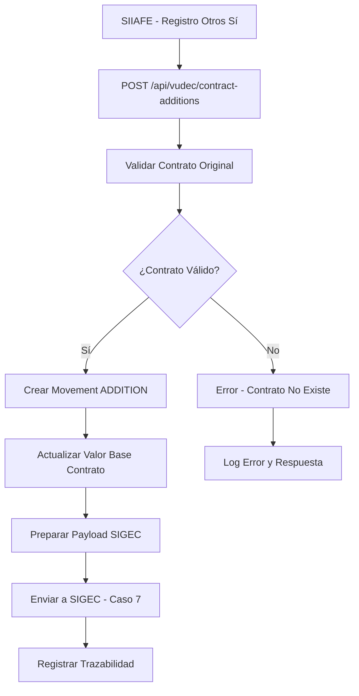

# HU005 - Proceso de otro sí contractual

## Descripción de la Historia de Usuario

**Como** sistema VUDEC integrado con SIIAFE  
**Quiero** poder recibir y procesar notificaciones de "otros sí" contractuales que permiten adiciones de valor  
**Para que** se generen automáticamente los movimientos de tipo ADDITION, se actualice el valor base del contrato y se reporte correctamente a SIGEC (Caso de Uso 7)

## Contexto y Justificación

Los "otros sí" contractuales son modificaciones legales que permiten adicionar valor a contratos existentes. Según la Epic 002 y las especificaciones de SIIAFE, cuando se registra un **CONTRATO ADICIONAL (OTROSI) (30)**, el sistema debe:

1. **Recibir notificación** desde SIIAFE del "otros sí" registrado
2. **Validar** que el contrato original existe y está activo
3. **Crear movimiento** de tipo ADDITION con el valor adicionado
4. **Actualizar** el valor base del contrato original
5. **Reportar** a SIGEC según Caso de Uso 7
6. **Mantener trazabilidad** completa del proceso

## Problema Actual

- **Sin integración**: SIIAFE registra "otros sí" pero VUDEC no se entera automáticamente
- **Proceso manual**: Requiere intervención manual para actualizar contratos en VUDEC
- **Falta de trazabilidad**: No hay registro histórico de las adiciones contractuales
- **Desincronización**: SIGEC no recibe información oportuna de las modificaciones

## Solución Propuesta

### 🔹 Arquitectura de Integración



### 🔹 Endpoint de Integración

#### **POST /api/vudec/contract-additions**
```typescript
interface ContractAdditionRequest {
  originalContractCode: string;      // Código del contrato original
  additionContractCode: string;      // Código del contrato de adición (otros sí)
  additionValue: number;             // Valor a adicionar
  additionDate: Date;                // Fecha del otros sí
  taxpayerId?: string;               // ID de la entidad (opcional, se infiere del contrato)
  additionType: 'VALUE' | 'TIME' | 'SCOPE'; // Tipo de adición
  observations?: string;             // Observaciones del otros sí
  legalDocument?: string;            // Referencia al documento legal
  executionStartDate?: Date;         // Nueva fecha de inicio si aplica
  executionEndDate?: Date;           // Nueva fecha de fin si aplica
}

interface ContractAdditionResponse {
  success: boolean;
  message: string;
  movementId?: string;               // ID del movimiento creado
  updatedContractValue?: number;     // Nuevo valor del contrato
  sigecReportStatus?: 'PENDING' | 'SENT' | 'ERROR';
  errors?: string[];
}
```

### 🔹 Nuevo Tipo de Movimiento

```typescript
enum TypeMovement {
  Register = 'REGISTER',
  Adhesion = 'ADHESION',
  Apply = 'APPLY',
  ADDITION = 'ADDITION',     // 🆕 Movimiento de adición por otros sí
}

interface MovementAddition extends Movement {
  type: TypeMovement.ADDITION;
  originalContractCode: string;      // Referencia al contrato original
  additionContractCode: string;      // Código del otros sí
  additionValue: number;             // Valor adicionado
  additionType: string;              // Tipo de adición
  previousContractValue?: number;    // Valor anterior del contrato
  newContractValue?: number;         // Nuevo valor del contrato
}
```

## Casos de Uso Específicos

### 🔹 Caso de Uso Principal: Adición de Valor

#### Flujo Normal
1. **SIIAFE registra** "otros sí" con tipo CONTRATO ADICIONAL (OTROSI) (30)
2. **SIIAFE notifica** a VUDEC vía endpoint `/contract-additions`
3. **VUDEC valida** que el contrato original existe
4. **VUDEC crea** movimiento de tipo ADDITION
5. **VUDEC actualiza** el valor base del contrato
6. **VUDEC reporta** a SIGEC (Caso de Uso 7)
7. **VUDEC responde** confirmación a SIIAFE

#### Flujo Alternativo - Contrato No Existe
1. SIIAFE notifica "otros sí" para contrato inexistente
2. VUDEC valida y no encuentra el contrato
3. VUDEC responde error específico
4. SIIAFE puede reintentar o escalar el error

#### Flujo de Excepción - Error en SIGEC
1. Proceso normal hasta reporte a SIGEC
2. SIGEC rechaza o falla la comunicación
3. VUDEC marca el movimiento como pendiente de envío
4. Sistema de reintento procesa automáticamente

### 🔹 Validaciones de Negocio

```typescript
class ContractAdditionValidator {
  static validateAdditionRequest(request: ContractAdditionRequest): ValidationResult {
    const errors: string[] = [];
    
    // Validar contrato original existe
    if (!this.contractExists(request.originalContractCode)) {
      errors.push('Original contract does not exist');
    }
    
    // Validar valor de adición
    if (request.additionValue <= 0) {
      errors.push('Addition value must be positive');
    }
    
    // Validar fechas
    if (request.additionDate > new Date()) {
      errors.push('Addition date cannot be in the future');
    }
    
    // Validar no duplicación
    if (this.additionAlreadyExists(request.additionContractCode)) {
      errors.push('Addition contract already processed');
    }
    
    // Validar códigos SIGEC según documentación oficial
    if (!this.validateSigecCodes()) {
      errors.push('SIGEC configuration codes are invalid');
    }
    
    return { isValid: errors.length === 0, errors };
  }
  
  private static validateSigecCodes(): boolean {
    // Validar que los códigos SIGEC coincidan con la documentación oficial
    const validProcedureCodes = ['TR1', 'TR2', 'TR3', 'TR4', 'TR5'];
    const procedureCode = process.env.SIGEC_PARAMETRIC_PROCEDURE_CODE_ADDITION;
    
    return procedureCode === 'TR2'; // Solo TR2 es válido para adiciones
  }
}
```

## Criterios de Aceptación

### ✅ Criterio 1: Recepción de Notificaciones
- **Dado** que SIIAFE registra un "otros sí" contractual
- **Cuando** envía la notificación al endpoint `/contract-additions`
- **Entonces** VUDEC recibe y procesa la solicitud correctamente
- **Y** responde con confirmación o error específico
- **Y** se logea toda la transacción para auditoría

### ✅ Criterio 2: Creación de Movimiento ADDITION
- **Dado** que se recibe una notificación válida de "otros sí"
- **Cuando** se procesa la solicitud
- **Entonces** se crea un movimiento de tipo ADDITION
- **Y** el movimiento contiene toda la información del "otros sí"
- **Y** se asocia correctamente al contrato original

### ✅ Criterio 3: Actualización de Valor Contractual
- **Dado** que se crea un movimiento ADDITION
- **Cuando** se procesa exitosamente
- **Entonces** el valor base del contrato se actualiza sumando la adición
- **Y** se mantiene registro del valor anterior
- **Y** se actualiza la fecha de última modificación

### ✅ Criterio 4: Reporte a SIGEC (Caso de Uso 7)
- **Dado** que se procesa una adición contractual
- **Cuando** se completa la actualización local
- **Entonces** se reporta automáticamente a SIGEC según Caso de Uso 7
- **Y** se utiliza el token específico de la entidad
- **Y** se maneja la respuesta de SIGEC apropiadamente

### ✅ Criterio 5: Validaciones de Negocio
- **Dado** que se recibe una solicitud de "otros sí"
- **Cuando** se valida la información
- **Entonces** se verifican todas las reglas de negocio
- **Y** se rechazan solicitudes inválidas con errores específicos
- **Y** se previene el procesamiento de duplicados

### ✅ Criterio 6: Trazabilidad y Auditoría
- **Dado** que se procesa cualquier "otros sí"
- **Cuando** se completa o falla el proceso
- **Entonces** se registra trazabilidad completa
- **Y** se pueden consultar históricos de modificaciones
- **Y** se mantiene auditoría de todos los cambios

## Tareas Técnicas Detalladas

### 🔹 Tarea 1: Endpoint de Integración
- [ ] Crear controller `ContractAdditionController`
- [ ] Implementar endpoint `POST /api/vudec/contract-additions`
- [ ] Definir DTOs de request y response
- [ ] Agregar validaciones de entrada
- [ ] Implementar manejo de errores específicos

### 🔹 Tarea 2: Servicio de Procesamiento
- [ ] Crear `ContractAdditionService`
- [ ] Implementar método `processContractAddition()`
- [ ] Integrar con `ContractService` existente
- [ ] Implementar validaciones de negocio
- [ ] Agregar lógica de actualización de valores

### 🔹 Tarea 3: Extensión de Movement Entity
- [ ] Agregar tipo `ADDITION` al enum `TypeMovement`
- [ ] Extender entidad Movement con campos específicos
- [ ] Crear migración de base de datos
- [ ] Actualizar DTOs de Movement
- [ ] Modificar queries y vistas si es necesario

### 🔹 Tarea 4: Integración con SIGEC
- [ ] Implementar lógica para Caso de Uso 7 de SIGEC
- [ ] Crear payload específico para adiciones contractuales
- [ ] Integrar con SigecService existente (Epic 001)
- [ ] Manejar respuestas y errores de SIGEC
- [ ] Implementar sistema de reintentos

### 🔹 Tarea 5: Validaciones y Reglas de Negocio
- [ ] Crear `ContractAdditionValidator`
- [ ] Implementar validaciones específicas
- [ ] Agregar prevención de duplicados
- [ ] Validar estados de contrato
- [ ] Implementar reglas de autorización

### 🔹 Tarea 6: Logging y Auditoría
- [ ] Implementar logging detallado del proceso
- [ ] Crear eventos para auditoría
- [ ] Registrar trazabilidad de cambios
- [ ] Implementar métricas de procesamiento
- [ ] Agregar alertas para errores críticos

### 🔹 Tarea 7: Testing y Validación
- [ ] Crear pruebas unitarias para todos los componentes
- [ ] Implementar pruebas de integración con endpoint
- [ ] Crear mocks para integración SIIAFE
- [ ] Probar integración con SIGEC
- [ ] Validar casos de error y excepciones

## Especificaciones de Integración SIGEC (Caso de Uso 7)

### Payload para SIGEC - Contrato Adicional (Caso de Uso 7)
```typescript
interface SigecContractAdditionPayload {
  // Campos obligatorios según documentación oficial SIGEC
  factCodeGenerator: string;            // Código del hecho generador (SECOP I/II/TVEC)
  generatorFactValue: number;           // Valor en pesos del hecho generador (nuevo valor total)
  generatorFactStartDate: string;       // Fecha de inicio del hecho generador (YYYY-MM-DD)
  generatorFactEndDate: string;         // Fecha final del hecho generador (YYYY-MM-DD)
  
  // Tipo de documento - debe ser "AD4" para contratos según documentación
  parametricActDocumentCodeType: string; // "AD4" para contratos
  
  // Gestión del acto - TR2 para Adición según documentación oficial
  parametricprocedureCode: "TR2";      // "TR2" - Adición (valor fijo para otros sí)
  
  // Información del contratista
  payerDocumentParametricTypeCode: string; // Tipo de identificación del contratista
  taxpayerDocumentNumber: string;       // Número de identificación del contratista
  taxpayerName: string;                 // Nombres y apellidos o Razón social del contratista
  
  // Campos adicionales para contexto de adición
  originalContractCode?: string;        // Código del contrato original (para referencia interna)
  additionValue?: number;               // Valor específico de la adición (para auditoría)
  additionDate?: string;                // Fecha del otros sí (para trazabilidad)
}
```

## Manejo de Errores

### Tipos de Error Esperados
```typescript
enum ContractAdditionErrorType {
  CONTRACT_NOT_FOUND = 'CONTRACT_NOT_FOUND',
  INVALID_ADDITION_VALUE = 'INVALID_ADDITION_VALUE',
  DUPLICATE_ADDITION = 'DUPLICATE_ADDITION',
  SIGEC_COMMUNICATION_ERROR = 'SIGEC_COMMUNICATION_ERROR',
  VALIDATION_ERROR = 'VALIDATION_ERROR',
  UNAUTHORIZED_ENTITY = 'UNAUTHORIZED_ENTITY'
}

interface ContractAdditionError {
  type: ContractAdditionErrorType;
  message: string;
  details?: any;
  retryable: boolean;
}
```

## Configuración y Variables

### Variables de Entorno
```env
# Configuración de "otros sí" contractuales
CONTRACT_ADDITION_ENABLED=true
CONTRACT_ADDITION_MAX_RETRIES=3
CONTRACT_ADDITION_RETRY_DELAY=5000

# Validaciones
CONTRACT_ADDITION_MAX_VALUE=999999999999
CONTRACT_ADDITION_MIN_VALUE=1

# SIGEC Caso de Uso 7 - Configuración oficial
SIGEC_CASE_7_ENABLED=true
SIGEC_CASE_7_TIMEOUT=30000
SIGEC_PARAMETRIC_PROCEDURE_CODE_ADDITION="TR2"
SIGEC_PARAMETRIC_ACT_DOCUMENT_CODE_TYPE="AD4"
```

## Métricas y Monitoreo

### Métricas Clave
- Número de "otros sí" procesados exitosamente
- Tiempo promedio de procesamiento
- Errores por tipo y frecuencia
- Tasa de éxito en reporte a SIGEC
- Volumen de adiciones por día/mes

### Alertas
- Error en procesamiento de "otros sí"
- Falla en comunicación con SIGEC
- Volumen anormal de solicitudes
- Errores de validación recurrentes

## Definición de Terminado (DoD)

- [ ] Endpoint `/contract-additions` implementado y funcional
- [ ] Tipo de movimiento ADDITION operativo
- [ ] Validaciones de negocio implementadas y probadas
- [ ] Integración con SIGEC (Caso de Uso 7) funcionando
- [ ] Actualización de valores contractuales correcta
- [ ] Sistema de logging y auditoría completo
- [ ] Pruebas unitarias implementadas (cobertura ≥ 80%)
- [ ] Pruebas de integración exitosas
- [ ] Documentación técnica completa
- [ ] Validación en ambiente de staging
- [ ] Code review aprobado
- [ ] Sin defectos críticos o de alta prioridad

## Estimación y Prioridad

- **Story Points**: 13
- **Prioridad**: Alta
- **Sprint Sugerido**: Sprint 3
- **Duración Estimada**: 2-3 semanas
- **Dependencias**: Epic 001 (tokens SIGEC), infraestructura de contratos existente

## Enlaces y Referencias

- [📋 Epic 002 - Adecuaciones CU SIIAFE](./Epic%20002%20-%20Adecuaciones%20CU%20SIIAFE.md)
- [🔗 HU006 - Proceso de cesión contractual](./HU006%20-%20Proceso%20cesion%20contractual.md)
- [🗄️ Entidad Contract](../../main/vudec/contract/entity/contract.entity.ts)
- [🔧 Servicios SIGEC](../../external-api/sigec/services/)
- [📋 Epic 001 - Descentralizadas](../epic%20-%20001/Epic%20001%20-%20Descentralizadas.md)

---

**Fecha de Creación**: Octubre 2025  
**Última Actualización**: Octubre 2025  
**Responsable**: Equipo Backend  
**Estado**: 📋 Documentado - Listo para desarrollo

## Notas Adicionales

- Esta HU es crítica para la automatización del proceso de "otros sí" contractuales
- La coordinación con SIIAFE es fundamental para las pruebas de integración
- El Caso de Uso 7 de SIGEC debe ser validado exhaustivamente
- La implementación debe mantener compatibilidad total con el sistema contractual existente
