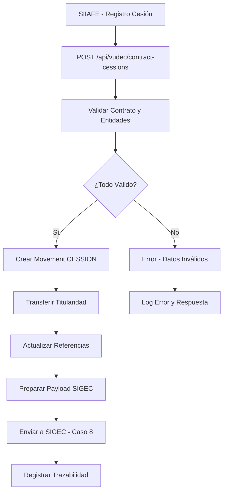

# HU006 - Proceso de cesión contractual

## Descripción de la Historia de Usuario

**Como** sistema VUDEC integrado con SIIAFE  
**Quiero** poder recibir y procesar notificaciones de cesiones contractuales que transfieren contratos entre entidades  
**Para que** se generen automáticamente los movimientos de tipo CESSION, se actualice la entidad titular del contrato y se reporte correctamente a SIGEC (Caso de Uso 8)

## Contexto y Justificación

Las cesiones contractuales son procesos legales mediante los cuales se transfiere la titularidad de un contrato de una entidad a otra. Según la Epic 002 y las especificaciones de SIIAFE, cuando se registra una **CESIÓN CONTRACTUAL (31)**, el sistema debe:

1. **Recibir notificación** desde SIIAFE de la cesión registrada
2. **Validar** que el contrato original existe y las entidades son válidas
3. **Crear movimiento** de tipo CESSION con información completa
4. **Transferir titularidad** del contrato a la nueva entidad
5. **Reportar** a SIGEC según Caso de Uso 8
6. **Mantener trazabilidad** completa del cambio de titularidad

## Problema Actual

- **Sin automatización**: Las cesiones se registran manualmente
- **Inconsistencias**: Riesgo de discrepancias entre SIIAFE y VUDEC
- **Falta de control**: No hay validaciones automáticas de elegibilidad
- **Reporte manual**: SIGEC no se actualiza automáticamente
- **Pérdida de trazabilidad**: No hay historial claro de transferencias

## Solución Propuesta

### 🔹 Arquitectura de Integración



### 🔹 Endpoint de Integración

#### **POST /api/vudec/contract-cessions**
```typescript
interface ContractCessionRequest {
  contractCode: string;                  // Código del contrato a ceder
  cessionContractCode: string;           // Código del contrato de cesión
  currentTaxpayerId: string;             // ID de la entidad cedente
  newTaxpayerId: string;                 // ID de la entidad cesionaria
  cessionDate: Date;                     // Fecha de la cesión
  cessionValue?: number;                 // Valor de la cesión (puede ser diferente al contrato)
  cessionType: 'FULL' | 'PARTIAL';      // Tipo de cesión
  partialPercentage?: number;            // % si es cesión parcial
  legalDocument: string;                 // Referencia al documento legal
  effectiveDate: Date;                   // Fecha efectiva de la cesión
  observations?: string;                 // Observaciones de la cesión
  notificationRequired?: boolean;        // Si requiere notificación especial
}

interface ContractCessionResponse {
  success: boolean;
  message: string;
  movementId?: string;                   // ID del movimiento creado
  updatedContractTaxpayerId?: string;    // Nueva entidad titular
  sigecReportStatus?: 'PENDING' | 'SENT' | 'ERROR';
  warnings?: string[];                   // Advertencias no críticas
  errors?: string[];
}
```

### 🔹 Nuevo Tipo de Movimiento

```typescript
enum TypeMovement {
  Register = 'REGISTER',
  Adhesion = 'ADHESION',
  Apply = 'APPLY',
  ADDITION = 'ADDITION',
  CESSION = 'CESSION',     // 🆕 Movimiento de cesión contractual
}

interface MovementCession extends Movement {
  type: TypeMovement.CESSION;
  contractCode: string;                  // Contrato cedido
  cessionContractCode: string;           // Código del contrato de cesión
  previousTaxpayerId: string;            // Entidad cedente
  newTaxpayerId: string;                 // Entidad cesionaria
  cessionValue?: number;                 // Valor de la cesión
  cessionType: string;                   // Tipo de cesión
  partialPercentage?: number;            // Porcentaje si es parcial
  effectiveDate: Date;                   // Fecha efectiva
  legalDocumentReference: string;        // Referencia legal
}
```

### 🔹 Actualización de Entidad Contract

```typescript
interface ContractCessionHistory {
  id: string;
  contractId: string;
  previousTaxpayerId: string;
  newTaxpayerId: string;
  cessionDate: Date;
  effectiveDate: Date;
  cessionType: 'FULL' | 'PARTIAL';
  partialPercentage?: number;
  movementId: string;                    // Referencia al movimiento
  status: 'ACTIVE' | 'REVERSED';
  createdAt: Date;
}

// Extensión de Contract Entity
class Contract {
  // ... campos existentes
  
  @OneToMany(() => ContractCessionHistory, cession => cession.contract)
  cessionHistory: ContractCessionHistory[];
  
  @Column({ nullable: true })
  lastCessionDate?: Date;
  
  @Column({ default: false })
  hasCessions: boolean;
}
```

## Casos de Uso Específicos

### 🔹 Caso de Uso Principal: Cesión Total

#### Flujo Normal - Cesión Completa
1. **SIIAFE registra** cesión contractual tipo CESIÓN CONTRACTUAL (31)
2. **SIIAFE notifica** a VUDEC vía endpoint `/contract-cessions`
3. **VUDEC valida** contrato existe y entidades son válidas
4. **VUDEC verifica** que entidad cedente es titular actual
5. **VUDEC crea** movimiento de tipo CESSION
6. **VUDEC transfiere** titularidad a nueva entidad
7. **VUDEC actualiza** todas las referencias necesarias
8. **VUDEC reporta** a SIGEC (Caso de Uso 8)
9. **VUDEC responde** confirmación a SIIAFE

#### Flujo Alternativo - Cesión Parcial
1. Proceso similar hasta validación
2. VUDEC valida porcentaje de cesión parcial
3. VUDEC crea nuevo contrato para la parte cedida
4. VUDEC ajusta valor del contrato original
5. VUDEC reporta ambos contratos a SIGEC
6. VUDEC mantiene trazabilidad de la división

### 🔹 Caso de Uso Secundario: Cesión entre Entidades Descentralizadas

#### Consideraciones Especiales
- Validar que ambas entidades tienen configuración SIGEC
- Usar tokens SIGEC apropiados para cada entidad
- Verificar permisos de cesión entre entidades
- Mantener coherencia con estructura descentralizada

### 🔹 Validaciones de Negocio

```typescript
class ContractCessionValidator {
  static validateCessionRequest(request: ContractCessionRequest): ValidationResult {
    const errors: string[] = [];
    const warnings: string[] = [];
    
    // Validar contrato existe
    if (!this.contractExists(request.contractCode)) {
      errors.push('Contract does not exist');
    }
    
    // Validar entidad cedente es titular actual
    if (!this.isCurrentOwner(request.contractCode, request.currentTaxpayerId)) {
      errors.push('Current taxpayer is not the contract owner');
    }
    
    // Validar entidad cesionaria existe y está activa
    if (!this.taxpayerExistsAndActive(request.newTaxpayerId)) {
      errors.push('New taxpayer does not exist or is inactive');
    }
    
    // Validar cesión parcial
    if (request.cessionType === 'PARTIAL') {
      if (!request.partialPercentage || request.partialPercentage <= 0 || request.partialPercentage >= 100) {
        errors.push('Invalid partial percentage for partial cession');
      }
    }
    
    // Validar fechas
    if (request.effectiveDate > new Date()) {
      warnings.push('Effective date is in the future');
    }
    
    // Validar no cesión duplicada
    if (this.cessionAlreadyExists(request.cessionContractCode)) {
      errors.push('Cession contract already processed');
    }
    
    // Validar capacidad de la entidad cesionaria
    if (!this.validateTaxpayerCapacity(request.newTaxpayerId)) {
      warnings.push('New taxpayer may not have capacity for this contract');
    }
    
    // Validar códigos SIGEC según documentación oficial
    if (!this.validateSigecCodes()) {
      errors.push('SIGEC configuration codes are invalid');
    }
    
    return { isValid: errors.length === 0, errors, warnings };
  }
  
  private static validateSigecCodes(): boolean {
    // Validar que los códigos SIGEC coincidan con la documentación oficial
    const validProcedureCodes = ['TR1', 'TR2', 'TR3', 'TR4', 'TR5'];
    const procedureCode = process.env.SIGEC_PARAMETRIC_PROCEDURE_CODE_CESSION;
    
    return procedureCode === 'TR4'; // Solo TR4 es válido para cesiones
  }
}
```

## Criterios de Aceptación

### ✅ Criterio 1: Recepción y Validación
- **Dado** que SIIAFE registra una cesión contractual
- **Cuando** envía la notificación al endpoint `/contract-cessions`
- **Entonces** VUDEC recibe y valida todos los datos
- **Y** verifica que el contrato y entidades existen
- **Y** confirma que la entidad cedente es titular actual

### ✅ Criterio 2: Creación de Movimiento CESSION
- **Dado** que se recibe una notificación válida de cesión
- **Cuando** se procesa la solicitud
- **Entonces** se crea un movimiento de tipo CESSION
- **Y** el movimiento contiene toda la información de la cesión
- **Y** se registra la trazabilidad completa

### ✅ Criterio 3: Transferencia de Titularidad
- **Dado** que se procesa una cesión válida
- **Cuando** se completa la validación
- **Entonces** se actualiza la titularidad del contrato
- **Y** se registra el cambio en el historial de cesiones
- **Y** se actualizan todas las referencias relacionadas

### ✅ Criterio 4: Manejo de Cesiones Parciales
- **Dado** que se recibe una cesión de tipo PARTIAL
- **Cuando** se procesa correctamente
- **Entonces** se crea un nuevo contrato para la parte cedida
- **Y** se ajusta el valor del contrato original
- **Y** se mantiene la relación entre ambos contratos

### ✅ Criterio 5: Reporte a SIGEC (Caso de Uso 8)
- **Dado** que se completa una cesión
- **Cuando** la transferencia es exitosa
- **Entonces** se reporta automáticamente a SIGEC
- **Y** se utilizan los tokens apropiados para cada entidad
- **Y** se maneja la respuesta de SIGEC correctamente

### ✅ Criterio 6: Entidades Descentralizadas
- **Dado** que la cesión involucra entidades descentralizadas
- **Cuando** se procesa la transferencia
- **Entonces** se utilizan las configuraciones SIGEC específicas
- **Y** se respetan las restricciones de entidades descentralizadas
- **Y** se reporta usando los tokens correspondientes

### ✅ Criterio 7: Trazabilidad y Auditoría
- **Dado** que se procesa cualquier cesión
- **Cuando** se completa o falla
- **Entonces** se registra historial completo de la operación
- **Y** se puede rastrear la cadena de titularidad
- **Y** se mantiene auditoría de todos los cambios

## Tareas Técnicas Detalladas

### 🔹 Tarea 1: Endpoint de Cesión
- [ ] Crear controller `ContractCessionController`
- [ ] Implementar endpoint `POST /api/vudec/contract-cessions`
- [ ] Definir DTOs de request y response
- [ ] Agregar validaciones de entrada robustas
- [ ] Implementar manejo de errores específicos

### 🔹 Tarea 2: Servicio de Procesamiento
- [ ] Crear `ContractCessionService`
- [ ] Implementar método `processContractCession()`
- [ ] Integrar con servicios existentes (Contract, Taxpayer)
- [ ] Implementar lógica de transferencia de titularidad
- [ ] Agregar manejo de cesiones parciales

### 🔹 Tarea 3: Extensión de Entidades
- [ ] Agregar tipo `CESSION` al enum `TypeMovement`
- [ ] Crear entidad `ContractCessionHistory`
- [ ] Extender entidad Contract con campos de cesión
- [ ] Crear migraciones de base de datos
- [ ] Actualizar relaciones entre entidades

### 🔹 Tarea 4: Historial y Trazabilidad
- [ ] Implementar sistema de historial de cesiones
- [ ] Crear queries para consultar cadena de titularidad
- [ ] Implementar reversión de cesiones si es necesario
- [ ] Agregar endpoints de consulta de historial
- [ ] Crear vistas para auditoría

### 🔹 Tarea 5: Integración con SIGEC
- [ ] Implementar Caso de Uso 8 de SIGEC para cesiones
- [ ] Crear payload específico para cesiones
- [ ] Manejar cesiones de entidades descentralizadas
- [ ] Implementar lógica de tokens por entidad
- [ ] Agregar manejo de errores y reintentos

### 🔹 Tarea 6: Validaciones de Negocio
- [ ] Crear `ContractCessionValidator`
- [ ] Implementar validaciones de titularidad
- [ ] Validar capacidad de entidades
- [ ] Agregar verificaciones de estado de contrato
- [ ] Implementar reglas específicas para cesiones parciales

### 🔹 Tarea 7: Testing Integral
- [ ] Crear pruebas unitarias para todos los componentes
- [ ] Implementar pruebas de integración completas
- [ ] Probar casos de cesión total y parcial
- [ ] Validar integración con SIGEC
- [ ] Probar escenarios de error y recuperación

## Especificaciones de Integración SIGEC (Caso de Uso 8)

### Payload para SIGEC - Cesión Contractual (Caso de Uso 8)
```typescript
interface SigecContractCessionPayload {
  // Campos obligatorios según documentación oficial SIGEC
  factCodeGenerator: string;            // Código del hecho generador (SECOP I/II/TVEC)
  generatorFactValue: number;           // Valor en pesos del hecho generador
  generatorFactStartDate: string;       // Fecha de inicio del hecho generador (YYYY-MM-DD)
  generatorFactEndDate: string;         // Fecha final del hecho generador (YYYY-MM-DD)
  
  // Tipo de documento - debe ser "AD4" para contratos según documentación
  parametricActDocumentCodeType: string; // "AD4" para contratos
  
  // Gestión del acto - TR4 para Sesión según documentación oficial
  parametricprocedureCode: "TR4";      // "TR4" - Sesión (valor fijo para cesiones)
  
  // Información del nuevo contratista (cesionario)
  payerDocumentParametricTypeCode: string; // Tipo de identificación del nuevo contratista
  taxpayerDocumentNumber: string;       // Número de identificación del nuevo contratista
  taxpayerName: string;                 // Nombres y apellidos o Razón social del nuevo contratista
  
  // Campos adicionales para contexto de cesión (uso interno)
  originalContractCode?: string;        // Código del contrato original
  cessionContractCode?: string;         // Código del contrato de cesión
  previousTaxpayerDocumentNumber?: string; // Documento del cedente (para auditoría)
  previousTaxpayerName?: string;        // Nombre del cedente (para auditoría)
  cessionDate?: string;                 // Fecha de cesión (para trazabilidad)
  cessionType?: string;                 // FULL o PARTIAL (para control interno)
  partialPercentage?: number;           // Porcentaje si es cesión parcial
}
```

### Flujo de Reporte Dual para Cesiones Parciales
```typescript
interface SigecPartialCessionFlow {
  // 1. Reportar contrato original con valor ajustado
  originalContractUpdate: SigecContractCessionPayload;
  
  // 2. Reportar nuevo contrato para la parte cedida
  newContractReport: SigecContractRegistrationPayload;
  
  // 3. Establecer relación entre contratos
  contractRelation: {
    parentContractCode: string;
    childContractCode: string;
    relationType: 'PARTIAL_CESSION';
    percentage: number;
  };
}
```

## Manejo de Errores Específicos

### Tipos de Error para Cesiones
```typescript
enum ContractCessionErrorType {
  CONTRACT_NOT_FOUND = 'CONTRACT_NOT_FOUND',
  INVALID_CURRENT_OWNER = 'INVALID_CURRENT_OWNER',
  NEW_TAXPAYER_INVALID = 'NEW_TAXPAYER_INVALID',
  DUPLICATE_CESSION = 'DUPLICATE_CESSION',
  INVALID_CESSION_TYPE = 'INVALID_CESSION_TYPE',
  INVALID_PARTIAL_PERCENTAGE = 'INVALID_PARTIAL_PERCENTAGE',
  CONTRACT_NOT_ELIGIBLE = 'CONTRACT_NOT_ELIGIBLE',
  SIGEC_COMMUNICATION_ERROR = 'SIGEC_COMMUNICATION_ERROR',
  TAXPAYER_CAPACITY_ERROR = 'TAXPAYER_CAPACITY_ERROR',
  EFFECTIVE_DATE_ERROR = 'EFFECTIVE_DATE_ERROR'
}

interface ContractCessionError {
  type: ContractCessionErrorType;
  message: string;
  field?: string;                        // Campo específico con error
  details?: any;
  retryable: boolean;
  suggestions?: string[];                // Sugerencias para resolver
}
```

## Configuración y Variables

### Variables de Entorno
```env
# Configuración de cesiones contractuales
CONTRACT_CESSION_ENABLED=true
CONTRACT_CESSION_MAX_RETRIES=3
CONTRACT_CESSION_RETRY_DELAY=5000

# Validaciones
CONTRACT_CESSION_MIN_PARTIAL_PERCENTAGE=1
CONTRACT_CESSION_MAX_PARTIAL_PERCENTAGE=99
CONTRACT_CESSION_REQUIRE_LEGAL_DOC=true

# SIGEC Caso de Uso 8 - Configuración oficial
SIGEC_CASE_8_ENABLED=true
SIGEC_CASE_8_TIMEOUT=30000
SIGEC_DUAL_REPORT_PARTIAL_CESSIONS=true
SIGEC_PARAMETRIC_PROCEDURE_CODE_CESSION="TR4"
SIGEC_PARAMETRIC_ACT_DOCUMENT_CODE_TYPE="AD4"

# Capacidad de entidades
TAXPAYER_CAPACITY_CHECK_ENABLED=true
TAXPAYER_MAX_CONTRACTS_DEFAULT=100
```

## Métricas y Monitoreo

### Métricas Clave
- Número de cesiones procesadas por tipo (total/parcial)
- Tiempo promedio de procesamiento de cesiones
- Tasa de éxito en transferencias de titularidad
- Errores por tipo y entidad
- Volumen de cesiones por entidad y período

### Dashboards Específicos
- **Panel de Cesiones**: Visualización de transferencias por período
- **Cadena de Titularidad**: Trazabilidad visual de contratos
- **Salud de Integración**: Estado de reportes a SIGEC
- **Capacidad de Entidades**: Monitoreo de límites y alertas

### Alertas Críticas
- Falla en transferencia de titularidad
- Error en reporte dual a SIGEC (cesiones parciales)
- Cesión duplicada detectada
- Entidad cesionaria sin capacidad
- Fallos recurrentes en validación

## Casos de Prueba Específicos

### 🔹 Pruebas de Cesión Total
```typescript
describe('Contract Cession - Full Transfer', () => {
  it('should transfer contract ownership completely', async () => {
    // Arrange: Contrato con titular A
    // Act: Procesar cesión total a titular B
    // Assert: Titular B es nuevo dueño, titular A no tiene relación
  });
  
  it('should handle SIGEC reporting for full cession', async () => {
    // Arrange: Cesión total válida
    // Act: Procesar y reportar a SIGEC
    // Assert: Reporte exitoso con datos correctos
  });
});
```

### 🔹 Pruebas de Cesión Parcial
```typescript
describe('Contract Cession - Partial Transfer', () => {
  it('should create new contract for ceded portion', async () => {
    // Arrange: Contrato original $100M, cesión 30%
    // Act: Procesar cesión parcial
    // Assert: Contrato original $70M, nuevo contrato $30M
  });
  
  it('should maintain relationship between parent and child contracts', async () => {
    // Arrange: Cesión parcial procesada
    // Act: Consultar relaciones
    // Assert: Relación padre-hijo establecida correctamente
  });
});
```

## Definición de Terminado (DoD)

- [ ] Endpoint `/contract-cessions` implementado y funcional
- [ ] Tipo de movimiento CESSION completamente operativo
- [ ] Sistema de transferencia de titularidad robusto
- [ ] Manejo completo de cesiones parciales
- [ ] Historial y trazabilidad de cesiones implementado
- [ ] Integración con SIGEC (Caso de Uso 8) funcionando
- [ ] Validaciones de negocio exhaustivas implementadas
- [ ] Sistema de logging y auditoría completo
- [ ] Pruebas unitarias implementadas (cobertura ≥ 85%)
- [ ] Pruebas de integración exitosas para todos los escenarios
- [ ] Documentación técnica y de usuario completa
- [ ] Validación en ambiente de staging
- [ ] Performance testing para volúmenes esperados
- [ ] Code review aprobado por arquitecto
- [ ] Sin defectos críticos o de alta prioridad
- [ ] Métricas y monitoreo configurados

## Estimación y Prioridad

- **Story Points**: 21
- **Prioridad**: Alta
- **Sprint Sugerido**: Sprint 4-5
- **Duración Estimada**: 3-4 semanas
- **Dependencias**: 
  - Epic 001 (tokens SIGEC por entidad)
  - HU005 (infraestructura de movimientos)
  - Sistema contractual robusto

## Enlaces y Referencias

- [📋 Epic 002 - Adecuaciones CU SIIAFE](./Epic%20002%20-%20Adecuaciones%20CU%20SIIAFE.md)
- [🔗 HU005 - Proceso de otro sí contractual](./HU005%20-%20Proceso%20de%20otro%20si%20contractual.md)
- [🗄️ Entidad Contract](../../main/vudec/contract/entity/contract.entity.ts)
- [🔧 Servicios SIGEC](../../external-api/sigec/services/)
- [👥 Entidad Taxpayer](../../main/vudec/taxpayer/entity/taxpayer.entity.ts)
- [📋 Epic 001 - Descentralizadas](../epic%20-%20001/Epic%20001%20-%20Descentralizadas.md)

---

**Fecha de Creación**: Octubre 2025  
**Última Actualización**: Octubre 2025  
**Responsable**: Equipo Backend  
**Estado**: 📋 Documentado - Listo para desarrollo

## Notas Adicionales

- **Complejidad Alta**: Esta HU maneja transferencias de titularidad, requiere especial cuidado
- **Impacto Legal**: Las cesiones tienen implicaciones legales, validaciones exhaustivas son críticas
- **Integración Dual**: Cesiones parciales requieren reportes duales a SIGEC
- **Trazabilidad Crítica**: El historial de cesiones debe ser inmutable y completo
- **Coordinación SIIAFE**: Requiere coordinación estrecha para pruebas de integración
- **Capacidad de Entidades**: Implementar límites y validaciones de capacidad
- **Rollback**: Considerar mecanismos de reversión en caso de errores críticos
