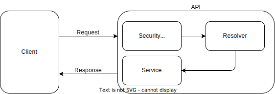

[Home](../../../README.md) > [System Modules Documentation](../../docs/modules.md) > [Security Module Documentation]

# 🔐 **Security Module Documentation**

## 🔍 **Introduction**

The Security Module is a crucial component of the VUDEC system that manages authentication, authorization, user management, role-based access control (RBAC), and audit logging. This module ensures system integrity, data protection, and comprehensive access control through various security mechanisms and industry-standard practices.



## 📋 **Overview**

The Security Module serves as the foundation for all security-related functionalities in the VUDEC system. It implements a layered security approach, starting from user authentication and session management to role-based permissions, detailed audit trails, and comprehensive data validation. This module provides both internal security mechanisms and integration points with external systems like SIIAFE and SWIT.

## 📂 **Module Structure**

```
src/security/
├── auth/                 # Authentication and authorization functionality
│   ├── controllers/      # Authentication REST endpoints
│   ├── decorators/       # Custom security decorators
│   ├── dto/              # Authentication DTOs
│   ├── guards/           # Security guards
│   ├── resolver/         # GraphQL resolvers
│   ├── service/          # Authentication services
│   ├── strategies/       # Authentication strategies
│   ├── docs/             # Module documentation
│   └── auth.module.ts    # Module definition
├── users/                # User management functionality
│   ├── controllers/      # User management REST endpoints
│   ├── dto/              # User-related DTOs
│   ├── entities/         # User entities
│   ├── resolvers/        # User GraphQL resolvers
│   ├── services/         # User services
│   ├── docs/             # Module documentation
│   └── users.module.ts   # Module definition
├── roles/                # Role management
│   ├── role/             # Core role functionality
│   ├── role-fx-url/      # URL-based role permissions
│   └── roles.module.ts   # Module definition
├── user-role/            # User-role relationships
├── user-key/             # API key management
├── audit/                # Audit logging
├── groups/               # User group management
├── functionalities/      # System functionalities management
├── decorators/           # Security decorators
├── interceptors/         # Security interceptors
├── docs/                 # Module documentation
└── security.module.ts    # Main module definition
```

## ⭐ **Core Submodules**

### **1. [🔑 Authentication](../auth/docs/auth.md)**

The Authentication submodule handles user verification and session management. It provides a robust authentication system based on JWT tokens, supporting both standard username/password authentication and integration with external systems.

#### **Key Features**

- **🔒 JWT-based Authentication**
  - Secure token generation and validation
  - Refresh token mechanism
  - Token revocation and expiration management
  - Session tracking

- **🚪 Login Methods**
  - Standard username/password authentication
  - SSO integration with SIIAFE/SWIT
  - API key-based authentication for services
  - Multi-factor authentication support

- **💻 Example: Authenticating a User**
  ```typescript
  // Using the AuthService to authenticate a user
  const authResponse = await authService.signIn(context, {
    email: "user@example.com",
    password: "securePassword123"
  });
  
  // The response contains a JWT token and user information
  const token = authResponse.token;
  const user = authResponse.user;
  ```

### **2. [👥 User Management](../users/docs/users.md)**

The User Management submodule provides comprehensive user lifecycle management, handling everything from user creation and profile management to password recovery and account status control.

#### **Key Features**

- **👤 User Operations**
  - User registration and profile management
  - Password management (change, reset, recovery)
  - User status control (active, inactive, locked)
  - Profile information management

- **🧑‍💼 User Types and Status**
  - Super administrators with full system access
  - Administrative users with role-based permissions
  - Standard users with limited access
  - External/public users for special cases

- **💻 Example: Creating a New User**
  ```typescript
  // Using the UsersService to create a new user
  const newUser = await usersService.createUser(context, {
    email: "newuser@example.com",
    name: "New",
    lastName: "User",
    identificationType: UserDocumentTypes.NATIONAL_ID,
    identificationNumber: "1234567890",
    password: "SecurePass123",
    roleId: "role-uuid-here"
  });
  ```

### **3. [🛡️ Role Management](../roles/role/docs/role.md)**

The Role Management submodule handles the creation and management of roles and their associated permissions. It supports role hierarchies, inheritance, and fine-grained permission control.

#### **Key Features**

- **👑 Role Management**
  - Role creation and configuration
  - Role inheritance and hierarchy
  - System and custom roles
  - Role-based access control

- **🔐 Permission Control**
  - Granular permission definitions
  - Operation-level access control
  - Resource-based permissions
  - URL path-based access control

- **💻 Example: Checking Role Permissions**
  ```typescript
  // Using a guard to check if a user has the required role
  @UseGuards(JwtAuthGuard, RoleGuard)
  @Roles(UserRoles.ADMIN)
  @Mutation(() => User)
  async createUser(@Context() context: IContext, @Args('input') input: CreateUserInput) {
    return this.usersService.createUser(context, input);
  }
  ```

### **4. [🔄 User-Role Assignment](../user-role/docs/user-role.md)**

The User-Role Assignment submodule manages the relationships between users and roles, allowing for dynamic assignment and management of user permissions through role associations.

#### **Key Features**

- **🔗 Assignment Operations**
  - Assigning roles to users
  - Removing roles from users
  - Bulk role management
  - Default role assignment

- **⚙️ Role Application**
  - Role validation at runtime
  - User permission context
  - Dynamic role-based access control

- **💻 Example: Assigning a Role to a User**
  ```typescript
  // Using the UserRoleService to assign a role to a user
  const userRole = await userRoleService.createUserRoles(context, userId, [
    "role-id-1", 
    "role-id-2"
  ]);
  ```

### **5. [🔑 API Key Management](../user-key/docs/user-key.md)**

The API Key Management submodule manages authentication codes, tokens, and API keys for both user authentication and system-to-system integrations.

#### **Key Features**

- **🔑 API Key Operations**
  - Key generation and registration
  - Key validation and verification
  - Key revocation and expiration
  - Scope-based key limitations

- **🔢 Code-based Authentication**
  - One-time password generation
  - Verification code management
  - Time-limited code validation
  - Multi-channel delivery (email, SMS)

- **💻 Example: Validating an Authentication Code**
  ```typescript
  // Using the UserKeyService to check a verification code
  const isValid = await userKeyService.checkCode(
    context,
    "123456",
    user,
    "password-recovery"
  );
  
  if (isValid) {
    // Code is valid, proceed with authentication
    const token = await userKeyService.generateJwtToken(user);
    return { token };
  }
  ```

### **6. [📝 Audit System](../audit/audit.md)**

The Audit System records and tracks all significant actions within the application, providing a detailed audit trail for security, compliance, and troubleshooting purposes.

#### **Key Features**

- **📊 Action Logging**
  - User action tracking
  - System change recording
  - Data modification tracking
  - Security event logging

- **📜 Audit Trail**
  - Comprehensive activity history
  - Before/after state comparison
  - Actor identification
  - Timestamp and IP recording

- **💻 Example: Recording an Audit Event**
  ```typescript
  // Using the AuditService to record a system action
  await auditService.createAudit({
    context,
    service: 'UserService',
    action: ActionTypeAudit.UPDATE,
    entityId: user.id,
    entityName: 'User',
    valueBefore: JSON.stringify(oldUserData),
    valueAfter: JSON.stringify(newUserData)
  });
  ```

### **7. [👪 User Groups](../groups/docs/groups.md)**

The User Groups submodule manages collections of users, allowing for easier assignment of permissions and roles to multiple users simultaneously.

#### **Key Features**

- **👥 Group Operations**
  - Group creation and management
  - User assignment to groups
  - Group-based permissions
  - Organizational structure mapping

- **🏢 Group Applications**
  - Bulk permission assignment
  - Departmental/organizational grouping
  - Hierarchical user management

- **💻 Example: Creating a User Group**
  ```typescript
  // Using the GroupsService to create a new user group
  const newGroup = await groupsService.createGroup(context, {
    name: "Finance Department",
    description: "Users from the finance department",
    userIds: ["user1-uuid", "user2-uuid", "user3-uuid"]
  });
  ```

### **8. [⚙️ Functionalities](../functionalities/functionality/docs/functionality.md)**

The Functionalities submodule manages system features and their permissions, providing a clear mapping between system capabilities and user access rights.

#### **Key Features**

- **📋 Functionality Management**
  - System feature definitions
  - Feature permission mapping
  - Feature-based access control
  - Feature detection and registration

- **🔄 Permission Mapping**
  - Role-to-functionality mapping
  - URL-to-functionality mapping
  - Operation-to-functionality mapping

- **💻 Example: Checking Feature Access**
  ```typescript
  // Using the FunctionalityService to check access to a feature
  const hasAccess = await functionalityService.hasFunctionalityAccess(
    context,
    "security.users.create"
  );
  
  if (hasAccess) {
    // Allow access to the functionality
    return this.usersService.createUser(context, input);
  } else {
    throw new ForbiddenException("Access denied");
  }
  ```

### **9. [🎯 Security Decorators](../decorators/decorators.md)**

Security Decorators provide a declarative approach to implementing security controls on controllers, resolvers, and methods.

#### **Key Features**

- **🔐 Authentication Decorators**
  - Role requirements
  - Permission requirements
  - User status validation
  - API key validation

- **🔧 Usage Patterns**
  - Method-level security
  - Controller-level security
  - Resolver field security

- **💻 Example: Using Security Decorators**
  ```typescript
  @Controller('users')
  @UseGuards(JwtAuthGuard)
  export class UsersController {
    constructor(private usersService: UsersService) {}
    
    @Get()
    @Roles(UserRoles.ADMIN)
    @UserStatus(UserStatusTypes.ACTIVE)
    async getAllUsers(@Context() context: IContext) {
      return this.usersService.findAll(context);
    }
  }
  ```

### **10. 🛡️ Security Interceptors**

Security Interceptors provide request-level protection and validation before request handling occurs.

#### **Key Features**

- **🔍 Request Interceptors**
  - External API key validation
  - User status verification
  - Admin privilege checking
  - Request transformation

- **💻 Implementation**
  ```typescript
  @Injectable()
  export class UserStatusInterceptor implements NestInterceptor {
    constructor(private reflector: Reflector) {}
    
    intercept(context: ExecutionContext, next: CallHandler): Observable<any> {
      const request = context.switchToHttp().getRequest();
      const user = request.user;
      
      const requiredStatuses = this.reflector.get<UserStatusTypes[]>(
        'statuses',
        context.getHandler()
      );
      
      if (!requiredStatuses) {
        return next.handle();
      }
      
      if (!requiredStatuses.includes(user?.status)) {
        throw new ForbiddenException('User status not allowed');
      }
      
      return next.handle();
    }
  }
  ```

## 🌐 **Integration Points**

### **1. External System Authentication**

- **🔄 SIIAFE Integration**
  - Token exchange mechanisms
  - User context sharing
  - Permission mapping
  - SSO flows

- **🔄 SWIT Integration**
  - Authentication handshakes
  - User synchronization
  - Session propagation

### **2. 📣 Security Events**

The Security module implements an event-driven architecture for security events:

- **📢 Event Types**
  - Authentication events (login, logout, failed attempts)
  - Authorization failures
  - User lifecycle events (creation, modification, deactivation)
  - Password events (reset, change, expiration)

- **📬 Event Handling**
  - Event logging and persistence
  - Notification triggers
  - Security alerts
  - Compliance tracking

## 🛠️ **Data Validation**

The Security module implements robust validation techniques:

- **✅ Class Validation**
  - [Class-Validator Implementation](./class-validator.md)
  - DTO validation
  - Input sanitization
  - Custom validators

- **📊 GraphQL Type Safety**
  - [Custom GraphQL Scalars](./graphql-scalar.md)
  - Type validation
  - Input/Output type checking
  - Schema validation

## ✨ **Best Practices**

### **1. 🔐 Password Security**
- Secure password hashing with bcrypt
- Password complexity requirements (minimum length, character variety)
- Password expiration and history policies
- Secure password reset procedures

### **2. 🔑 Token Management**
- Short-lived JWT tokens with refresh mechanism
- Secure token storage recommendations
- Token revocation strategies
- Token scope limitations

### **3. 🛡️ API Security**
- Rate limiting to prevent brute force attacks
- Request validation and sanitization
- Proper error handling to prevent information leakage
- CORS configuration to prevent cross-site attacks

### **4. 📘 Development Guidelines**
- Always use authentication guards for protected resources
- Implement the principle of least privilege for roles
- Record audit trails for all sensitive operations
- Validate all user inputs

## ⚠️ **Error Handling**

The Security module implements standardized error handling:

### **1. 🚫 Authentication Errors**
- Invalid credentials (wrong username/password)
- Expired tokens
- Invalid or malformed tokens
- Account lockout after failed attempts

### **2. ⛔ Authorization Errors**
- Insufficient permissions
- Role validation failures
- Missing roles
- Access denied to resources

## ⚙️ **Configuration**

### **1. 🔧 Environment Variables**
```env
JWT_SECRET=your_secret_key        # JWT secret key
JWT_EXPIRES_IN=1h                 # JWT expiration time
JWT_REFRESH_EXPIRES_IN=30d        # JWT refresh token expiration
TOKEN_VERIFICATION_LIMIT=5        # Max verification attempts
FAILED_LOGIN_ATTEMPTS=5           # Max failed login attempts before lockout
```

### **2. 🔧 Security Settings**
- JWT token configuration
- Password complexity requirements
- Session timeouts
- IP address filtering

## 🎯 **Conclusion**

The Security module provides a comprehensive security framework for the VUDEC system, addressing all aspects of authentication, authorization, and audit logging. By implementing industry best practices and standards, the module creates a robust security foundation that protects the system against unauthorized access and ensures data integrity.

For detailed implementation of specific security components, refer to the individual submodule documentation linked throughout this document.